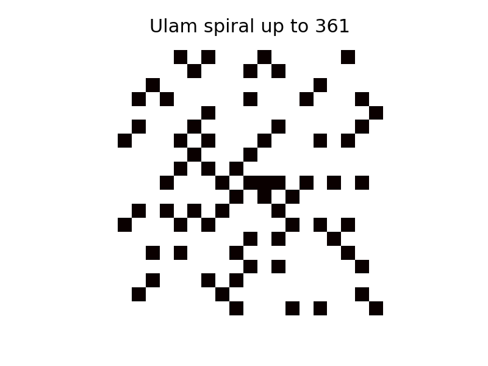
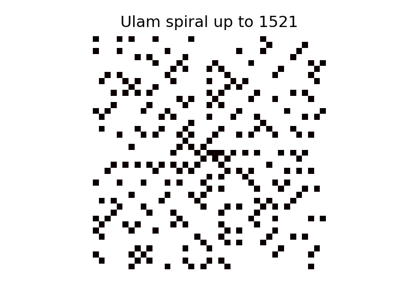
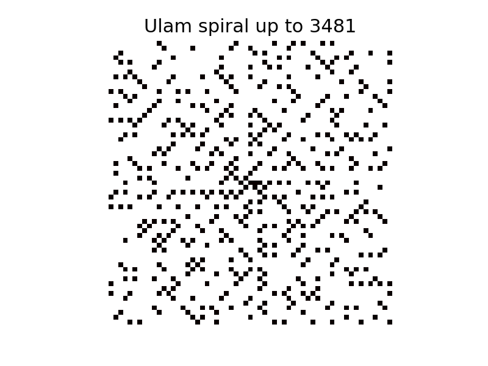
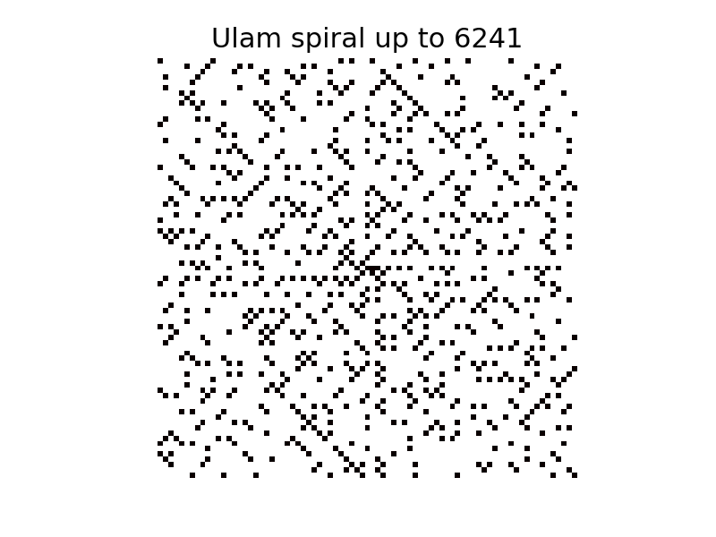
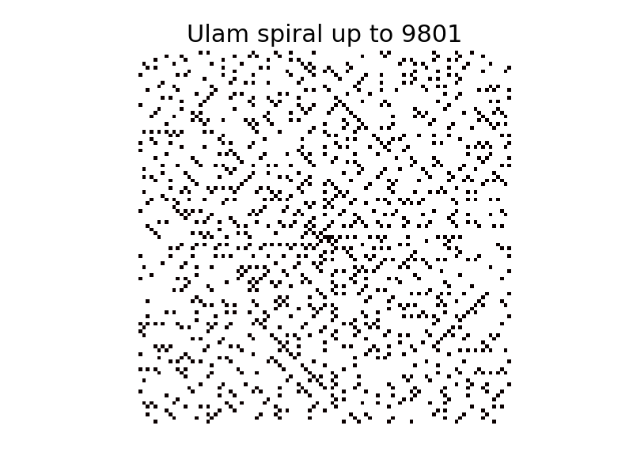

# ulam-spiral
The Ulam prime spiral generator

This is a short code to generate the <a href="https://en.wikipedia.org/wiki/Ulam_spiral">Ulam spiral</a> - a 2D graphical representation of the distribution of prime numbers. Integers are laid out in a square spiral and prime numbers are highlighted. Surprisingly, primes in such a layout form neat straight lines. I first learned about this from a <a href="https://www.youtube.com/watch?v=iFuR97YcSLM"> Youtube video </a> by the brilliant channel <a href=https://www.youtube.com/channel/UCoxcjq-8xIDTYp3uz647V5A>Numberphile</a>, and had to implement it myself to believe it.

### Generated spirals (the black cells are primes):

